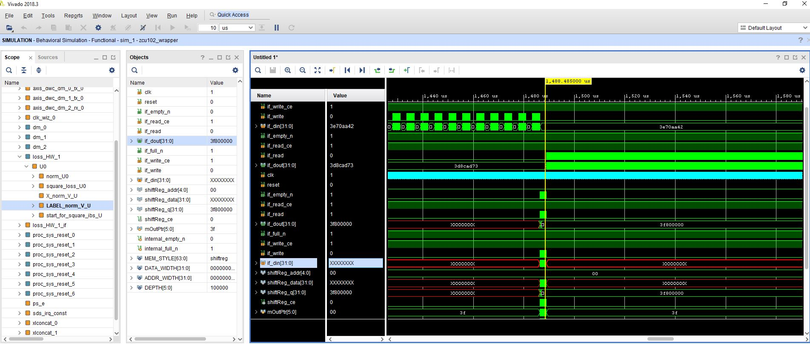

# ESE532fall2019_emulation
This repo is to show you how to use simulation and emulation to debug your code, which will be implemented by SDSoC.

# Description
SDSoC is an excellent tool for SoC design. It exclude a lot of gluing logic design between hardware and software. The designers can focus on some high level architection design. However, it abstracts away some essential details, which is bad for debugging. Nevertheless, it offers you some methods, by which you can do some low level debuging. Emulation is one of the useful tools, which we will focus on in the following sections.

# Buffer Lock Example
Include all the source code under ./examples/BufferLock/ into SDSoC. Move the `loss_HW` into hardware as figure below.

This system is to use DMA to transfer data and labels into hardware and do some calculations and return the data back into DDR ram. We will use `hls:stream` data type to connect the module `norm` and `square_loss`. If you create a `vivado_HLS` project and do the C simulation, it is tatally fine. However, if you compile the SDSoC, you will get nothing when downloading it into the board.  

## Emulation for the Buffer Lock
Now, let's use emulation to find the bugs. As the emulation does not support the Utral-96v2 yet, we tempararily create a ZCU102 board project to do the emulation as below. Make sure you use `A53 Linux` as the System configuration. Choose Target as `Emulation`.

After the compilation, we can open the hardware reports to see how the function and interface is implemented. From the report, we can see that the interface between `norm` and `square_loss` are 2 fifos, corresponding to `hls:stream` interfaces in software.

In the SDSoC, click `Xilinx->Start/Stop emulation`. A `vivado` software would jump out. Choose the signals you are interested in. Here we choose the IO of `X_norm_V_U` and `LABEL_norm_V_U`. Click run in the `vivado` side, and launch emulation in the software side. The fifo's full signal is asserted, but we did not see and input for the label_norm. 

We go back to look at the code. We can see the moudle `norm` is trying to send 4096 data X_norm and 128 data Label_norm to module `square_loss`. Here we intentionally set the module `sqaure_loss` to read data Label_norm first, so that a buffer lock shows up. In practise, to modules may have inbalanced inputs and we don't know which outputs would send more data into the channel fifo. Therefore this buffer lock can be eliminated by increasing the buffer size. We may increase the fifo to 4096 to make sure it can holds all the data even the consumer does not accept any data. At this time. the fifo for Label_norm does not need to be equal to 128. Here we keep it as 32. Then, compile the code and 

 
Repeate the emulation after we completed the compilation. Add the signals we are interested in and run it again. We can see after the X_norm is moved into the fifo, the Label_norm is transferred by the fifo channel. The producer and consumer are working together, which can save use some channel space for Label_norm.

Now, think about some ways to decrease the fifi size for X_norm. A lot of tricks you can use. The goal of this crappy architecture is just to show you how to debug the deadlock. We want to remind you that it is quite common that you create some fency architectures, the II is 1 and everthing is perfectly orchestrated. Downloading your bitstreams into your hardware, then you got just nothing. Don't be panic! Use emulation!

