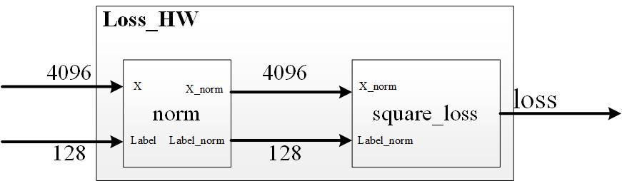

# ESE532fall2019_emulation
This repo is to show you how to use simulation and [emulation](https://github.com/Xilinx/SDSoC-Tutorials/blob/master/getting-started-tutorial/lab-8-emulation.md) to debug your code.

## 1. Description
SDSoC is an excellent tool for SoC design. It excludes a lot of gluing logic design between hardware and software. The designers can focus on some high- level architecture design. However, it abstracts away some essential details, which is bad for debugging. Nevertheless, it offers you some methods, by which you can do some low-level debugging. Emulation is one of the useful tools, which we will focus on in the following sections.


## 2. Buffer Lock Example
Include all the source code under ./examples/BufferLock/ into SDSoC. Move the `loss_HW` into hardware as figure below.


This system is to use DMA to transfer data and labels into hardware and do some calculations and return the data back into DDR ram. We will use [hls:stream](https://www.xilinx.com/html_docs/xilinx2017_4/sdaccel_doc/ylh1504034366220.html) data type to connect the module `norm` and `square_loss`. When different modules are connected by [stream interface](https://courses.cs.washington.edu/courses/cse590g/07sp/sdarticle.pdf), we are constructing [latency insensitive architecture](http://kalman.mee.tcd.ie/fpl2018/content/pdfs/FPL2018-43iDzVTplcpussvbfIaaHz/1PNSl54xKC7BAFw7YOeZRT/1sc2uahgEryvvJ7qQkPXkz.pdf), and it is good for pipeline. If you create a `vivado_HLS` project and do the C simulation, it should run without any errors. However, if you compile it in the SDSoC, you will get nothing when downloading it into the board.  
````c
void loss_HW(	float X[BATCH_SIZE*FEATURE_SIZE], float LABEL[BATCH_SIZE], float Loss[BATCH_SIZE])
{
//float X_norm[BATCH_SIZE][FEATURE_SIZE];
#pragma HLS dataflow
	hls::stream <float> LABEL_norm;
	hls::stream <float> X_norm;
//Real length of LABEL_norm is 128
#pragma HLS stream variable=LABEL_norm depth=32
//Real length of X_norm is 4096
#pragma HLS stream variable=X_norm depth=1024

	norm(X, LABEL, X_norm, LABEL_norm);
	square_loss(X_norm, LABEL_norm, Loss);

}
````



### 2.1 [Emulation](https://github.com/Xilinx/SDSoC-Tutorials/blob/master/getting-started-tutorial/lab-8-emulation.md) for the Buffer Lock
Now, let's use emulation to find the bugs. As the emulation does not support the Utral-96v2 yet, we temporarily create a ZCU102 project to do the emulation as below. Make sure you use `A53 Linux` as the System configuration. Choose Target as `Emulation`.


After the compilation, we can open the hardware reports to see how the function and interface is implemented. From the report, we can see that the interface between `norm` and `square_loss` are 2 fifos, corresponding to `hls:stream` interfaces in software.


In the SDSoC, click `Xilinx->Start/Stop emulation`. A `vivado` software would jump out. Choose the signals you are interested in. Here we choose the IO of `X_norm_V_U` and `LABEL_norm_V_U`. Click run on the `vivado` side, and launch emulation on the SDSoC side. The fifo's full signal is asserted, but we did not see any input for the label_norm. 


We go back to look at the [code](/examples/BufferLock/loss_HW.cpp). We can see the moudle `norm` is trying to send 4096 data X_norm and 128 data Label_norm to module `square_loss`. Here we intentionally set the module `sqaure_loss` to read data Label_norm first, so that a buffer lock shows up. In practice, a consumer module may have unbalanced inputs and we don't know which outputs of the producer module would send more data into the channel fifo. Therefore, this buffer lock can be eliminated by increasing the buffer size. We may increase the fifo to 4096 to make sure it can store all the data, even when the consumer does not accept any data. At this time. the fifo for Label_norm does not need to be equal to 128. Here we keep it as 32. Then, compile the code.

 
Repeat the emulation after we completed the compilation. Add the signals we are interested in and run it again. We can see after the X_norm is moved into the fifo, the Label_norm is transferred by the fifo channel. The producer and consumer are working together, which can save use some channel space for Label_norm.


### 2.2 Simulation for the Buffer Lock
Simulation is another quick way to debug. I think most of you used the C simulation in `vivado_hls`. We can also do the C/RTL co-simulation for debugging. It can give you some clues for the deadlock, but it is limited and can do nothing for the DMA related deadlock which is the real bottleneck for the project. However, it is faster and can give you quick hints.
Now let's create a `vivado_hls` project and add the buggy code into the project. After you compile your hardware, you will get a `Synthesis Report for 'loss_HW'. At this time, click `Solution-> Run C/RTL cosimulation`. Choose `Vivado Simulator for the `Verilog/VHDL Simulator Selection`, and choose `all` for the `Dump Trace`, then click `run`. For most cases, you can get `Pass`, if your code looks plausible. However, for this case, we get `ERROR!!! DEADLOCK DETECTED at 284950000 ns! SIMULATION WILL BE STOPPED!` . Now open the wave view by clicking the wave button as below and the `vivado` will jump out. Similar to emulation, you can add the important signals to the waveviewer. For this case, you may find `vivado_hls` seems to run faster than emulation. However, in most cases, `vivado_hls` may not find the bugs at all. Even with limited usage, it is a faster debugging tool, and we can quick start from this and do some quick debugging. If it does not work, go back to emulation, which is closest to the reality. 


Now, think about some ways to decrease the fifi size for X_norm. A lot of tricks you can use. The goal of this crappy architecture is just to show you how to debug the deadlock. We want to remind you that it is quite common that you create some fency architectures, the II is 1 and everthing is perfectly orchestrated. Downloading your bitstreams into your hardware, then you got just nothing. Don't be panic! Use emulation!


